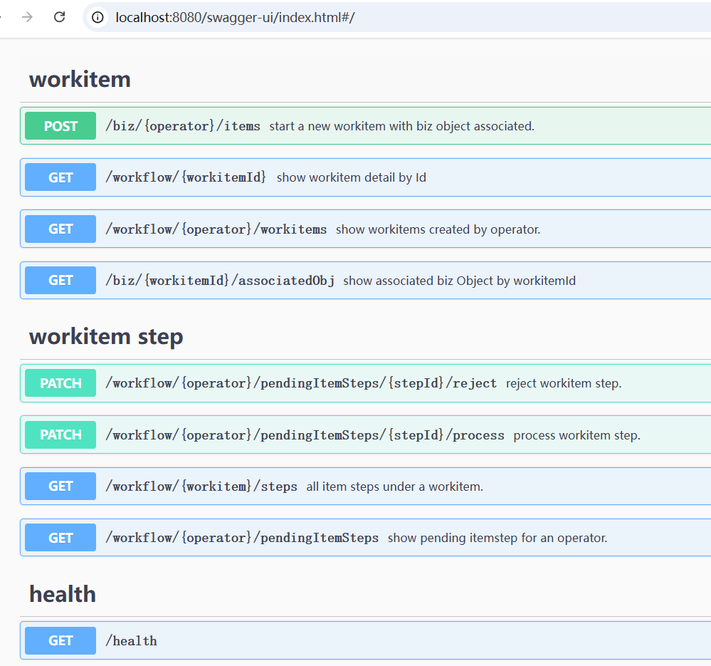

# Workflow Engine
An API for workflow engine.

## What does it do?
It offers a set API operations helping to manage workitem, the core feature includes:

Workitem:
* Start a workitem with customized Business object.
* Fetch associated Business Object by a workitemId.
* Fetch all workitems created by operator.

WorkItemStep:  
A workitem can go through different steps, e.g. an absence request(workitem) will go though Manger's approval, then audit's review...
* Fetch all workitems which are pending a specified operator's approval/rejection.
* Process a workitem acting as an reviewer, after approval, the workitem will be routed to next operator. 
* Reject a workitem acting as an reviewer.

WorkItem route policy definition:
* Refer to Case1DefaultRoutePolicy.java
* An Operation can be marked as autoChecked or manual checked.
* When AutoChecker exists, the specified operation will be triggered automatically and asynchronously.
* When AutoChecker does NOT exist, an explicit call to process workitem must be made in order to continue to process a workitem.

## Workflow Engine API specification.

[OpenAPI.json](openapi.json)

## Env setup

* [DB initialization script](src/main/resources/initdb.sql)
* Run [WorkflowEngineApplication.java](src/main/java/com/yaod/workflow/engine/WorkflowEngineApplication.java)

## Technical Features

* No 3rd workflow library is needed.
* It depends on Springboot, Mybatis, H2 database(default DB)
* H2 database console is enabled at http://localhost:8080/h2-console  , jdbc connection string: jdbc:h2:file:~/test by default.
* General workflow implementation are defined below [com.yaod.workflow.engine.core](src/main/java/com/yaod/workflow/engine/core), normally NO need to touch them.
* Different project should have their own domain, route policy... etc for their specific requirement, see example at [com.yaod.workflow.engine.usercase](src/main/java/com/yaod/workflow/engine/usercase)
* Sample router policy is defined [Case1DefaultRoutePolicy](src/main/java/com/yaod/workflow/engine/usercase/routepolicy/Case1DefaultRoutePolicy.java), of course, we can add support for xml/other  configuration file.

## Important notes:

* This is a POC project, aims to illustrate how workflow framework works, it is NOT a production ready library.